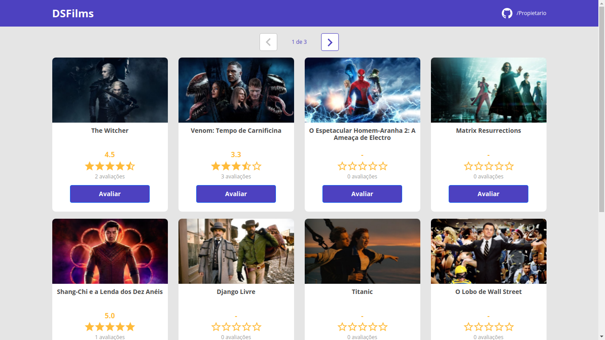
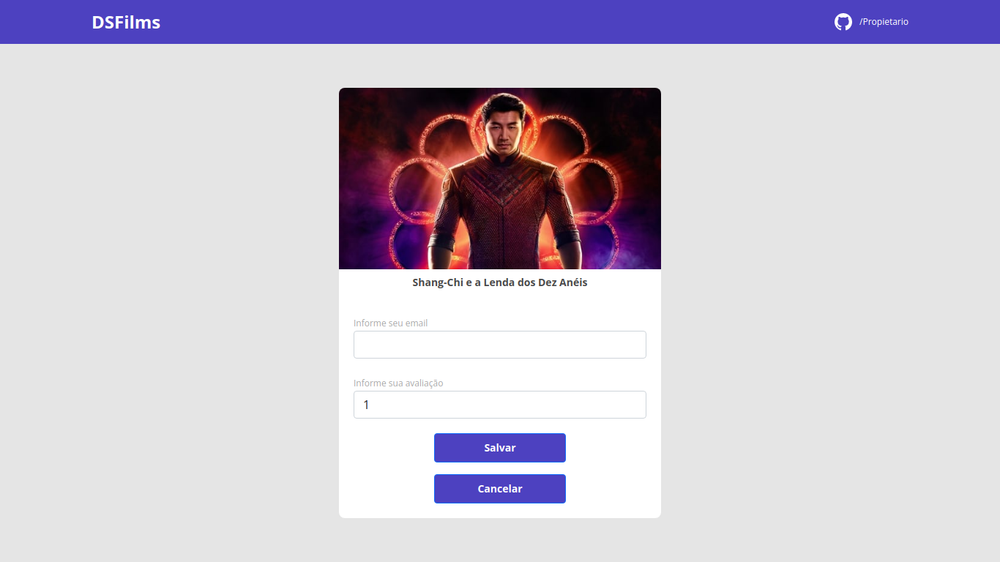

#### DSfilm - aplicação web para avaliar filmes.

<h1 style="padding: 50px; background: #333333;">
    
</h1>

<h1 style="padding: 50px; background: #333333;">
    
</h1>

🌎 **Acesse agora:**

<a href="https://dsfilm.netlify.app/" target="_blank" title="acessar o site"><strong>dsfilm.netlify.app/</strong></a>

 

### 🔥 Sobre o projeto

A aplicação consiste em exibir uma lista de filmes paginada a partir de dados fornecidos por um backend construído com Spring Boot.

 

### :space_invader: Modelo Conceitual

<h1 style="padding: 50px; background: #333333;">
    
</h1>

 

### 🤖 Tecnologias

- **Java 11**
- **Spring Boot**
- **Hibernate JPA**
- **React**
       React Hooks,
       useState,
       useEffect,
       useParams,
       useNavigate.
- **Bootstrap**
- **Typescript**
- **H2 Database**
- **PostgreSQL**
- **Axios**
- **Postman**
- **Netlify**
- **Heroku**
- **VSCode**
- **STS**

 

### 💎 Autor

    Daniel Soares

 
 

:point_down: Entre em contato.
 

